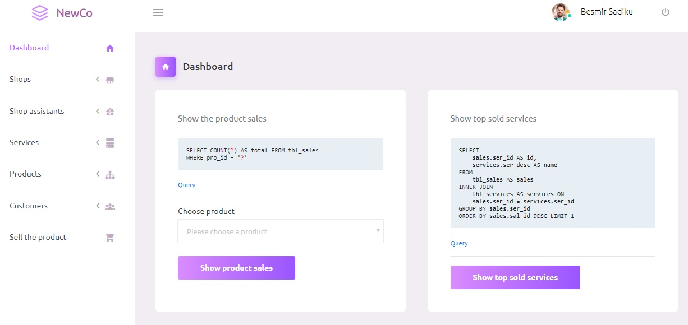

<h1>NewCo Admin Panel</h1>
NewCo Admin Panel is a free responsive admin template built with Bootstrap 4. The template has colorful, attractive yet simple and elegant design. The template is well crafted, with all the components neatly and carefully designed and arranged within the template.

<h1>Credits:</h1>

- Bootstrap 4
- Material Design Icons
- jQuery

<h1>Browser Support:</h1>

Purple Admin is designed to work flawlessly with all the latest and modern web browsers.

- Chrome (latest)
- FireFox (latest)
- Safari (latest)
- Opera (latest)
- IE10+  

<h1>How to use NewCo?</h1>

1 - Click the Clone or Download button in GitHub and download as a ZIP file or you can enter the command git clone https://github.com/BootstrapDash/PurpleAdmin-Free-Admin-Template.git in you terminal to get a copy of this template.

2 - After the files have been downloaded you will get a folder with all the required files

3 - Find the file sql/newco.sql, which contains some dummy data and import to a desired database

<h2>Next</h2>

After successfully installed, a login screen will be shown, use the following data to login to CMS
   
	username : admin
   
	password : admin

